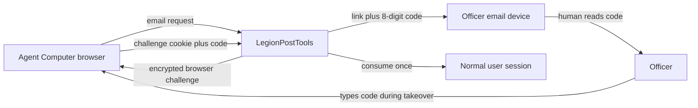
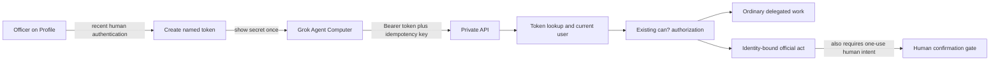

# Agent Sign-in and Access Design

## Purpose

The first officer-agent API assumed that Grok Bot could use the same magic-link
flow as a person sitting at the browser that received the email. That assumption
does not hold for Agent Computer: the email will often arrive on the officer's
phone or ordinary computer while the sign-in page is open on Grok's cloud
computer. Copying a long URL is awkward and may open the wrong browser.

Once signed in, a persistent browser cookie is adequate for supervised work but
is a fragile credential for scheduled or terminal-driven routines. Grok Bot needs
a named, revocable credential that can call the existing private API directly.

This phase adds both paths:

1. an emailed, human-readable code that completes sign-in on the browser that
   requested it; and
2. a personal agent access token for ordinary delegated API work.

Neither path changes the authority model. Grok Bot acts with the signed-in
officer's current grants. Identity-bound official acts still require separate,
fresh proof of human intent.

## Selected approach

We will extend the existing magic-link challenge rather than create passwords or
a parallel login system. Each valid email request produces both the existing
single-use link and an eight-digit code. A separate high-entropy browser challenge
binds the short code to the browser that requested the email.

We will add personal bearer tokens under Profile for reliable API calls. Tokens
represent the user's delegated authority and re-evaluate that user's grants on
every request. They are not a weaker bot account, and they are not sufficient
proof for approving, attesting, signing, accepting, or amending official minutes.

An OAuth provider or MCP connector is deliberately deferred. Those become useful
when several installations need connector-style onboarding; they are unnecessary
for one American Legion installation with an existing private JSON API.

## Desired invariants

- A short email code works only with the browser challenge that requested it.
- Link and code are two ways to consume the same challenge; either one invalidates
  the other.
- Codes and bearer secrets are never stored in plaintext.
- Unknown and disabled email addresses receive the same browser response as valid
  addresses, including an indistinguishable pending-challenge cookie shape.
- A code expires after 15 minutes, is invalidated after five failed attempts, and
  cannot be replayed after successful use.
- A bearer token is shown once, can be named and revoked, expires, and immediately
  stops working when its user is disabled.
- A bearer request never falls back to an ambient browser session. An invalid
  `Authorization` header is an unauthorized request even when a session cookie is
  also present.
- CSRF remains mandatory for cookie-authenticated writes. It is not required for a
  valid bearer-token request because the browser does not attach that credential
  automatically.
- Authorization still comes from `User#can?`; token authentication does not copy or
  freeze a separate permission set.
- Machine writes are replay-safe before unattended routines are enabled.
- No long-lived credential can substitute for fresh human intent on an
  identity-bound official-record act.

## Cross-device sign-in

### Challenge creation

`MagicLink.create_for!` will generate three independent values:

- the existing 256-bit URL token;
- an eight-digit numeric code displayed as `1234 5678`; and
- a 256-bit browser challenge selector.

The database stores only keyed digests of those values. The raw browser challenge
is placed in a short-lived encrypted, HTTP-only, SameSite cookie on the requesting
browser. For an unknown or disabled email address, the controller still places a
random value of the same shape in that cookie and redirects to the same code-entry
screen, but does not create a database row or send email.

The code is numeric because Post officers may need to read it from a phone and type
it on another computer. Eight digits plus browser binding, a five-attempt ceiling,
request rate limits, and a 15-minute lifetime provide a materially smaller online
guessing opportunity than a global six-digit code without making the field hostile
to older members.

### Consumption

The code endpoint normalizes spaces and a single visual separator, then looks up
the challenge by the browser-selector digest. It locks that row, checks expiry,
usage, attempt count, and current user status, and compares the code digest in
constant time.

A failed comparison increments the attempt count atomically. A fifth failure makes
the challenge unusable. A successful code or link marks the same row used, verifies
the email if needed, creates the normal `Session`, removes the pending cookie, and
redirects to the dashboard.



### Email and delivery boundary

Both Action Mailer templates and the published Loops transactional template must
show the code prominently above the existing sign-in button. The delivery seam
changes from `deliver_magic_link(user:, login_url:)` to include `login_code:`.
The production Loops template must be updated and safely validated before or with
deployment so production email never references a missing variable.

## Personal agent access tokens

### Ownership and lifecycle

Agent access is self-service under **Profile → Agent access**. A user can create a
token only for their own account. A `manage_settings` administrator may list and
revoke tokens across the installation for incident response, but cannot create a
token as another user and can never reveal a stored secret.

Creation requires recent authentication. If the session is not recently verified,
the user completes a passkey assertion or the new emailed-code flow before the app
issues the token. The initial implementation should record this on the `Session`
rather than treating an old 180-day session as sufficient proof to mint another
long-lived credential.

Email reauthentication is a separate challenge purpose bound to the current session
and token-creation action. It sends a code for entry on the requesting browser; it
does not create a new session when consumed. The existing sign-in challenge continues
to create a session. Keeping purpose and session binding in persisted challenge state
prevents a sign-in code from being reinterpreted as token-creation approval.

The creation form asks for a plain name such as “Grok Agent Computer” and offers
30-, 90-, and 180-day expiry choices, defaulting to 90 days. The result page shows
the token once with a Copy button and an ordinary selectable field. It must state
that all Bots on the same Grok computer may be able to use credentials stored there.

### Token representation

Use a recognizable format such as:

```text
lpt_<public-id>_<256-bit-secret>
```

The public id supports indexed lookup. Store a keyed digest of the secret, a safe
display hint, owner, name, expiry, last-used time, and revocation time. Never log or
persist the complete token. Compare the digest in constant time. Throttle
`last_used_at` updates so normal API traffic does not create a write on every read.

### Request authentication

`Api::BaseController` accepts either the existing browser session or
`Authorization: Bearer <token>`. If a bearer header is present, it is the sole
credential for that request. Valid bearer authentication sets both the accountable
user and the agent-token execution context before existing capability checks run.

The generated `/api` handbook adapts to the current credential:

- session callers receive CSRF instructions and a token;
- bearer callers receive bearer examples and no CSRF secret;
- both see only actions permitted by the user's current grants.



## Replay protection and provenance

Token-authenticated `POST`, `PATCH`, and future `DELETE` requests require an
`Idempotency-Key`. Persist the token, user, method, normalized path, key, request
fingerprint, response status, and response body behind a uniqueness constraint.
An exact retry returns the original response; reuse with different input returns
`409 Conflict`. Concurrent first uses must serialize so they cannot both perform the
mutation. Retain records long enough to cover scheduled retries, initially 30 days.

Current business models continue to record the accountable user. The API execution
record additionally identifies the agent token and idempotency key. This provides
useful provenance now and a foundation for the stricter official-record audit trail
required before minutes actions are exposed.

## User-interface direction

The work stays inside the established “The 1919” visual system. No new palette,
typeface, decorative motif, or app shell is introduced.

The email-code screen reuses the existing entry card. Its signature element is one
large, centered `1234 5678` field with generous spacing and a direct label, not eight
separate JavaScript-controlled boxes. Instructions say where to find the code, that
it works once for 15 minutes, and how to request another email. Errors say what the
user can do next without revealing whether an account exists.

The Profile section follows the passkey list vocabulary: token name first, then a
quiet metadata line for hint, expiry, and last use, with a clearly separated Revoke
action. The one-time token reveal is visually prominent but plain, keyboard
accessible, selectable without JavaScript, and usable at phone width.

Before completion, critique both flows at desktop and narrow widths, with keyboard
navigation, enlarged text, and JavaScript unavailable for the manual-copy fallback.

## Failure behavior

- Invalid, expired, already-used, wrong-browser, or exhausted codes use the same
  message: “That code is invalid or expired. Request a new email and try again.”
- Invalid, expired, revoked, malformed, or disabled-user bearer tokens return the
  normal API `401` JSON shape and never redirect.
- A missing idempotency key on a token-authenticated mutation returns `422`; reuse
  with a different request returns `409`.
- Revocation is effective on the next request; there is no token authentication
  cache that can outlive the database state.

## Out of scope

- Password authentication.
- Tokens created by administrators for another person.
- Permanent, non-expiring tokens.
- OAuth provider or device-authorization server.
- MCP transport or a `/plugins` connector.
- Per-Bot isolation inside Grok's shared computer.
- Official-minutes mutation endpoints or the later human-intent confirmation model.

## Success criteria

1. An officer can request sign-in on Agent Computer, read the email on a phone, type
   the code on Agent Computer, and finish sign-in there.
2. The existing one-click link continues to work and consumes the same challenge.
3. A user can create, copy once, list, and revoke a named agent token from Profile.
4. Grok Bot can use that token from its terminal to read `/api` and perform an
   idempotent permitted draft operation without a session cookie or CSRF token.
5. Permission removal, user disablement, expiry, and revocation take effect on the
   next request.
6. No token path grants or implies human confirmation for official minutes.
